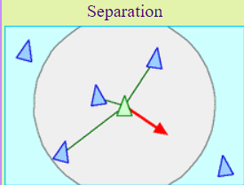
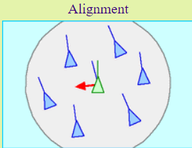
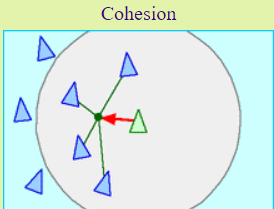

# Boid simulation

Boids is an artificial life simulation originally developed by Craig Reynolds. The aim of the simulation was to replicate the behavior of flocks of birds. Instead of controlling the interactions of an entire flock, however, the Boids simulation only specifies the behavior of each individual bird. With only a few simple rules, the program manages to generate a result that is complex and realistic enough to be used as a framework for computer graphics applications such as computer generated behavioral animation in motion picture films.

Here are the rules:

**Separation**
Each bird attempts to maintain a reasonable amount of distance between itself and any nearby birds, to prevent overcrowding.

 

**Alignment**
Birds try to change their position so that it corresponds with the average alignment of other nearby birds.

**Cohesion**
Every bird attempts to move towards the average position of other nearby birds.

